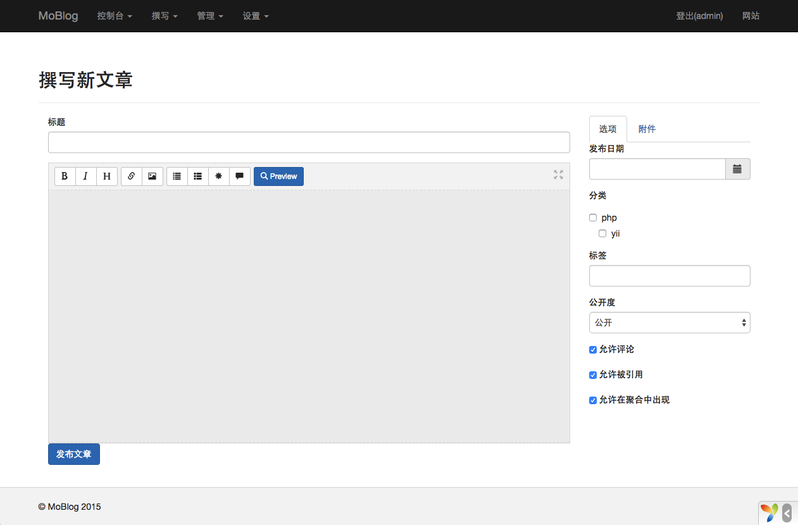

MoBlog
=====================================
###screenshot###

### Demo###

URL: [http://moblog.coding.io/](http://moblog.coding.io/)

###illustrate###

1. MoBlog is a blog system developed based on Yii2, and some functions are currently being improved

2. The database design directly adopts the database structure of `typecho`, and the functional structure also imitates `typecho`

3. In order to deploy to the coding demonstration platform, the yii command deployment method is omitted

###Install###

1. Download or clone source code, run `composer install` to install dependencies

2. Import the `common/data/blog.sql` file to the database, and configure the database components in the `common/config/main-local.php` file

3. Configure nginx or apache website root directory to `web` folder

4. Foreground access `index.php` file, background access `admin.php` file

5. Background account `admin` password `123456`

###protocol###

MIT
